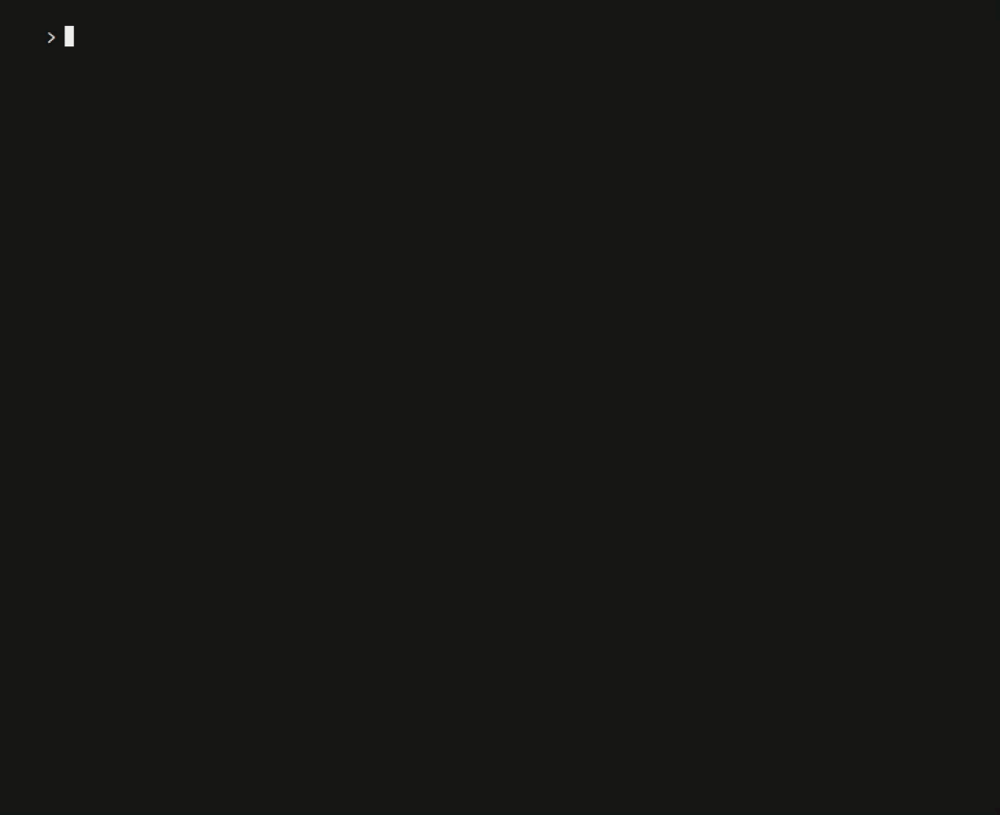

# 文件存储
AdonisJs 拥有一个基于 Flydrive 构建的专用 Drive Provider ，可与 Amazon S3 等本地和远程文件系统进行交互。

在本指南中，我们将学习如何设置和使用云端硬盘提供程序。

## 建立
由于默认情况下未安装云端硬盘驱动器，运行以下命令安装：
```bash
> adonis install @adonisjs/drive
```
接下来，我们需要在 start/app.js 文件中注册提供程序：
```javascript
const providers = [
  '@adonisjs/drive/providers/DriveProvider'
]
```
> 驱动程序配置保存在 config/drive.js 文件中，该文件是 adonis install 在安装 Drive Provider 时由命令创建的。
## 可用驱动程序
Drive Provider 随附的默认驱动程序包括：

- Amazon S3(s3)，需要 aws-sdk 包

- DigitalOcean Spaces(spaces)，需要 aws-sdk 包

- 本地文件系统(local)

## 基本例子
以下是如何通过 adonis repl 以下方式与本地磁盘进行交互的基本示例：



## 驱动 API
虽然读取和写入等常见操作在驱动程序中保持不变，但驱动器的 API 主要基于你用于与该驱动器的文件系统交互的驱动程序。

#### exists(relativePath)
查找文件/目录是否存在：
```javascript
const exists = await Drive.exists('unicorn.jpg')
```
#### get(relativePath, encoding = utf-8)
获取文件内容作为缓冲区或字符串：
```javascript
const unicorn = await Drive.get('unicorn.jpg')
```
#### getStream(relativePath)
获取文件作为流：
```javascript
Drive.getStream('hello.txt')
```
#### put(relativePath，content，options = {})
使用给定内容创建新文件(创建任何缺少的目录)：
```javascript
await Drive.put('hello.txt', Buffer.from('Hello world!'))
```
#### prepend(relativePath，content，options = {})
将内容预先添加到文件中(如果路径不存在，则创建新文件)：
```javascript
await Drive.prepend('hello.txt', Buffer.from('Prepended!'))
```
prepend方法仅适用于本地驱动程序。
#### append(relativePath，content，options = {})
将内容附加到文件(如果路径不存在，则创建新文件)：
```javascript
await Drive.append('hello.txt', Buffer.from('Appended!'))
```
append方法仅适用于本地驱动程序。
#### 删除(relativePath)
删除现有文件：
```javascript
await Drive.delete('hello.txt')
```
#### move(src，dest，options = {})
将文件从一个目录移动到另一个目录
```javascript
await Drive.move('hello.txt', 'hi.txt')
```
#### copy(src，dest，options = {})
将文件从一个目录复制到另一个目录
```javascript
await Drive.copy('hi.txt', 'hello.txt')
```
## S3 / Spaces API
以下方法仅适用于 s3 和 spaces 驱动程序。

#### getObject(location，params)
获取给定文件的 S3 对象(有关 params 信息，请参阅 S3 参数)：
```javascript
await Drive.disk('s3').getObject('unicorn.jpg')
```
#### getUrl(location，[bucket])
获取给定文件的 URL (接受可选的替代 bucket 参数)：
```javascript
const url = Drive.disk('s3').getUrl('unicorn.jpg')
```
#### getSignedUrl(location，expiry = 900，params)
获取给定文件的签名 URL ( 15 mins 默认设置为到期时间)：
```javascript
const url = await Drive.disk('s3').getSignedUrl('unicorn.jpg')
```