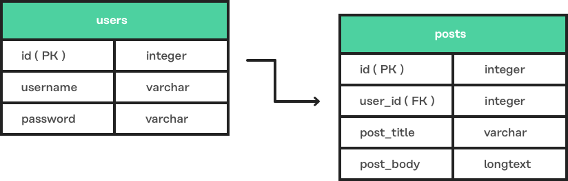
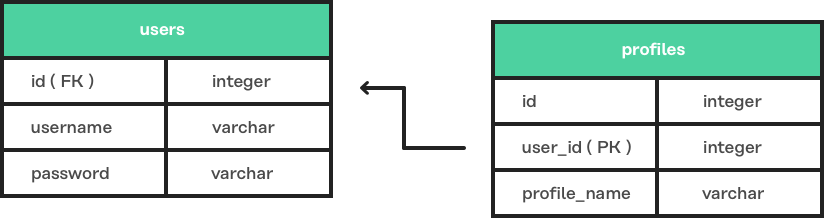
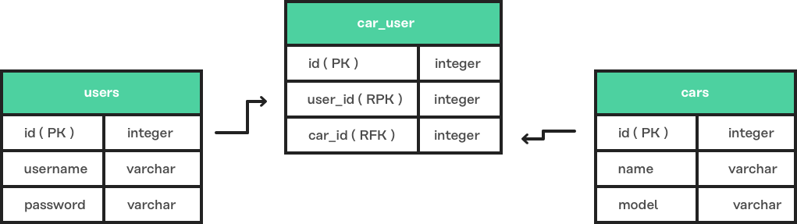
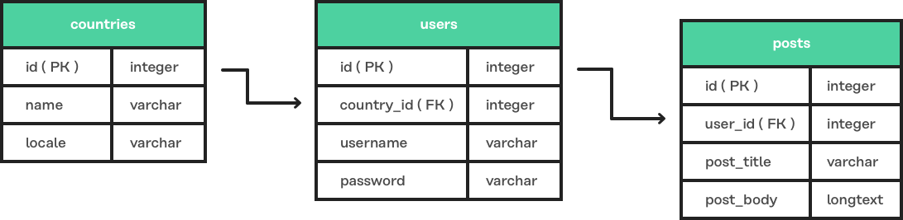

# 关联(一)
关联是数据驱动应用程序的支柱，将一种模型类型链接到另一种模型类型。

例如，一个 User 可以关联多个 Post ，每个 Post 关联 多个 Comment 。

 Lucid 的富有表现力的 API 使得关联和获取模型关联的过程变得简单直观，无需触摸 SQL 语句甚至编辑 SQL 模式。

## 基本例子
让我们来看一个包含两个模型的场景：User 和 Profile 。

在我们的示例中，每个 User 实例都可以有一个 Profile 。

我们称之为一对一的关联。

#### 定义关联
要定义关联，请将以下方法添加到 User 模型中：
```javascript
const Model = use('Model')

class User extends Model {
  profile () {
    return this.hasOne('App/Models/Profile')
  }
}

module.exports = User
```
在上面的示例中，我们向模型添加了一个  profile方法，User 返回 hasOne 键入模型的关联 Profile 。

如果 Profile 模型不存在，请生成它：
```javascript
adonis make:model Profile
```
```javascript
const Model = use('Model')

class Profile extends Model {
}

module.exports = Profile
```
> 无需在两个模型上定义关联。只需在单个模型上进行单向设置即可。
#### 获取用户个人资料
现在我们已经定义了 User 和 Profile 之间的关联，我们可以执行以下代码来获取用户的配置文件：
```javascript
const User = use('App/Models/User')

const user = await User.find(1)
const userProfile = await user.profile().fetch()
```
## hasOne
一个 hasOne 关联定义了一对一的使用关联外键的相关模型。

#### API
```javascript
hasOne(relatedModel, primaryKey, foreignKey)
```
**relatedModel**

对当前模型具有的模型的 IoC 容器引用。

**primaryKey**

默认为当前模型主键(即id)。

**foreignKey**

默认为 tableName_primaryKey 当前模型。使用表名的单数形式(例如，外键 user_id 引用 users 表上的列 id )。

#### 数据库表


#### 定义关联
```javascript
const Model = use('Model')

class User extends Model {
  profile () {
    return this.hasOne('App/Models/Profile')
  }
}

module.exports = User
```
## hasMany
一个 hasMany 关联定义了一对多使用的关联外键的其他相关模型。

#### API
```javascript
hasMany(relatedModel, primaryKey, foreignKey)
```
**relatedModel**

对模型的 IoC 容器引用，当前模型有很多。

**primaryKey**

默认为当前模型主键(即id)。

**foreignKey**

默认为 tableName_primaryKey 当前模型。使用表名的单数形式(例如，外键 user_id 引用 id 表上的列 users )。

#### 数据库表


#### 定义关联
```javascript
const Model = use('Model')

class User extends Model {
  posts () {
    return this.hasMany('App/Models/Post')
  }
}

module.exports = User
```
## belongsTo
belongsTo 关联是 hasOne 关联的反转，并应用于关联的另一端。

继续我们 User 和 Profile 示例， Profile 模型属于 User 模型，因此具有在 belongsTo 其上定义的关联。

#### API
```javascript
belongsTo(relatedModel, primaryKey, foreignKey)
```
**relatedModel**
 IoC 容器引用当前模型所属的模型。

**primaryKey**

默认为相关的模型外键(在我们 Profile 所属的 User 示例中，这将是 user_id )。

**foreignKey**

默认为相关的模型主键。

#### 数据库表



#### 定义关联
```javascript
const Model = use('Model')

class Profile extends Model {
  user () {
    return this.belongsTo('App/Models/User')
  }
}

module.exports = Profile
```
## belongsToMany
belongsToMany 关联允许你在两个模型上定义多对多的关联。

例如：

一个 User 可以有很多 Car 型号。

在其生命周期中 Car 可以有许多 User 模型(即所有者)。

由于这两个 User 和 Car 可以有其他模型的许多关联，我们说每个模型属于许多其他模型。

当定义一个 belongsToMany 关联，我们不存储在无论是作为我们为我们的模型表的外键 hasOne 和 hasMany 关联。

相反，我们必须依赖第三个称为数据透视表的中间表。

> 你可以使用迁移文件创建数据透视表。
#### API
```javascript
belongsToMany(
  relatedModel,
  foreignKey,
  relatedForeignKey,
  primaryKey,
  relatedPrimaryKey
)
```
**relatedModel**

对模型的IoC容器引用，当前模型有很多。

**foreignkey**

默认为当前模型外键(在我们的 User 关联 Car 示例中，这将是 user_id )。

**relatedForeignKey**
默认为相关的模型外键(在我们的User 多对多 Car 示例中，这将是 car_id )。

**主键**
默认为当前模型主键(即id)。

**relatedPrimaryKey**
默认为相关的模型主键(即id)。

#### 数据库表


#### 定义关联
```javascript
const Model = use('Model')

class User extends Model {
  cars () {
    return this.belongsToMany('App/Models/Car')
  }
}

module.exports = User
```
在上面的示例中，名为 car_user 的表是存储 car 和 user 模型主键之间唯一关系的透视表。

#### 数据透视表
默认情况下，透视表名称是通过按字母顺序对基于较低级别的相关模型名称进行排序，并将它们与 _ 字符（例如， user + car = car_user ）连接来派生的。

要设置自定义数据透视表名称，请调用 pivotTable 关联定义：
```javascript
cars () {
  return this
    .belongsToMany('App/Models/Car')
    .pivotTable('user_cars')
}
```
#### withTimestamps
默认情况下，数据透视表不具有时间戳。

要启用时间戳，请调用 withTimestamps 关联定义：
```javascript
cars () {
  return this
    .belongsToMany('App/Models/Car')
    .withTimestamps()
}
```
#### withPivot
默认情况下，只从数据透视表返回外键。

要返回其他数据透视表字段，请调用 withPivot 关联定义：
```javascript
cars () {
  return this
    .belongsToMany('App/Models/Car')
    .withPivot(['is_current_owner'])
}
```
#### pivotModel
要更好地控制对数据透视表的查询，可以绑定数据透视表模型：
```javascript
cars () {
  return this
    .belongsToMany('App/Models/Car')
    .pivotModel('App/Models/UserCar')
}
```
```javascript
const Model = use('Model')

class UserCar extends Model {
  static boot () {
    super.boot()
    this.addHook('beforeCreate', (userCar) => {
      userCar.is_current_owner = true
    })
  }
}

module.exports = UserCar
```
在上面的例子中， UserCar 是一个常规的 L​​ucid 模型。

通过 PivotModel ，你可以使用生命周期钩子，getter / setter 等。

调用 PivotModel 后，不能调用数据透视表和 withTimestamps 方法。相反，需要在透视模型本身上设置这些值。
## Many Through
 manyThrough 关联是定义间接关联的便捷方式。

例如：

一个用户属于一个国家。

一个用户有很多文章。

使用 manyThrough ，你可以获取指定国家下的所有文章 。

#### API
```javascript
manyThrough(
  relatedModel,
  relatedMethod,
  primaryKey,
  foreignKey
)
```
#### relatedModel
对模型的 IoC 容器引用，当前模型需要访问间接相关的模型。

#### relatedMethod
调用关联方法 relatedModel 来获取间接相关的模型结果。

**primaryKey**
默认为当前模型主键(即id)。

**foreignKey**
默认为当前模型的外键(在该例子中，这将是 country_id )。

#### 数据库表


#### 定义关联
关联需要在主要和中间模型上定义。

我们继续 Posts 和 Country 的例子，让我们定义所需 hasMany 的中介关联 User 模型：
```javascript
const Model = use('Model')

class User extends Model {
  posts () {
    return this.hasMany('App/Models/Post')
  }
}
```
最后，定义 manyThrough 的 Country 模型上的关联：
```javascript
const Model = use('Model')

class Country extends Model {
  posts () {
    return this.manyThrough('App/Models/User', 'posts')
  }
}
```
在上面的示例中，第二个参数是 posts 对 User 模型上方法的引用。

relatedMethod 参数必须始终传递给 manyThrough 方法的许多通过关联来工作。
## 查询数据
Lucid 的直观 API 极大地简化了查询相关数据，为所有类型的模型关联提供了一致的界面。

如果一个 User 有很多 Post 型号，我们可以为用户提取所有帖子，id = 1 如下所示：
```javascript
const User = use('App/Models/User')

const user = await User.find(1)
const posts = await user.posts().fetch()
```
通过调用 Query Builder 方法(如典型查询)来添加运行时约束：
```javascript
const user = await User.find(1)

// published posts
const posts = await user
  .posts()
  .where('is_published', true)
  .fetch()
```
上面的示例为用户提取所有已发布的帖子 id = 1 。

#### 查询数据透视表
你可以为 belongsToMany 透视表添加 where 子句，如下所示：
```javascript
const user = await User.find(1)

const cars = await user
  .cars()
  .wherePivot('is_current_owner', true)
  .fetch()
```
以上示例获取其当前所有者为用户的所有汽车 id = 1 。

这些方法 whereInPivot 和 orWherePivot 也可提供。
