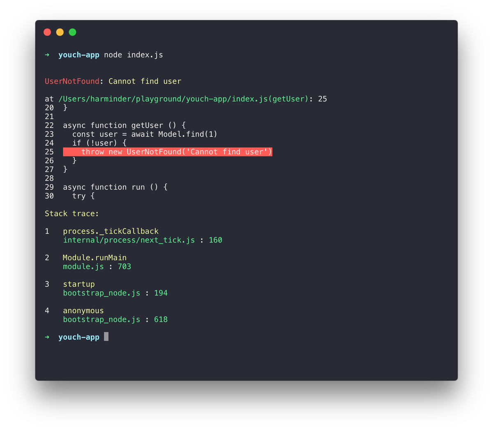

## 从4.0版本升级到4.1版本
4.1 版本包含了许多 bug 修复和 API 改进，以保持代码库的简单。尽管将破坏性的更改保持在最低限度，但仍然不能完全消除它们。以下是从 4.0 版本升级到 4.1 ，你需要注意的一些地方。
## 立即开始
第一步是更新所有依赖项。

我们使用npm-check来提取包的最新版本:
```JavaScript
npm install -g npm-check
```
运行以下命令更新依赖项:
```JavaScript
npm-check -u
```
## 异常处理
>如果你从未创建过全局异常处理程序，请忽略此部分。

最重要的更改之一是全局异常处理程序。
对 **app/Exceptions/Handler.js** 文件进行以下更改。
1. 确保异常处理程序扩展了 BaseExceptionHandler :
```javascript
const BaseExceptionHandler = use('BaseExceptionHandler')

class ExceptionHandler extends BaseExceptionHandler {
}
```
2. 调用 **super.handle** 处理你不想处理的异常:
```javascript
class ExceptionHandler extends BaseExceptionHandler {
  async handle (error, { response }) {
    if (error.name === 'UserNotFoundException') {
      // handle it yourself
      return
    }

    super.handle(...arguments)
  }
}
```
3. 最后，可以移除 **Exception.bind** ，因为所有异常都将路由到全局异常处理程序。
## 路由
### Route.url
**Route.url** 用于生成路由。

以前，**domain** 是作为字符串文本传递的。

现在是一个对象。

以前:
```javascript
Route.url('posts/:id', { id: 1 }, 'blog.adonisjs.com')
```
现在：
```javascript
Route.url('posts/:id', { id: 1 }, { domain: 'blog.adonisjs.com' })

```
## 验证器

验证器现在使用 **Indicative** 的最新版本，带来了以下的一些更改。

### 格式器
命名格式器的概念不再存在。

如果你想使用预先存在的 **formatter** ，而不是按名称传递，那么现在必须按引用传递。

以前:
```javascript
const { validate } = use('Validator')
validate(data, rules, messages, 'jsonapi')

```
现在：
```javascript
const { validate, formatters } = use('Validator')
validate(data, rules, messages, formatters.JsonApi)
```
这同样适用于路由验证器。

以前:
```javascript
class StoreUser {
  get formatter () {
    return 'jsonapi'
  }
}

```
现在：
```javascript
const { formatters } = use('Validator')

class StoreUser {
  get formatter () {
    return formatters.JsonApi
  }
}

```
### 配置
新版本的 Indicative 暴露了 **configure** 方法来定义库范围的默认值:
```javascript
const { formatters, configure } = use('Validator')

configure({
  FORMATTER: formatters.JsonApi
})
```
## 视图
### css
css全局已更改为style。不再支持css全局
以前：
```javascript
{{ css('style') }}
```
现在：
```javascript
{{ style('style') }}
```
## Lucid模型
以前，日期格式与新创建的记录和现有记录不一致。

在新版本中，这个问题已经得到了修复，只做了一个小的修改(请务必阅读相关 [issue](https://github.com/adonisjs/adonis-lucid/issues/245) )。

日期
date 字段不再自动转换为模型上的 **moment** 实例。

以前:
```javascript
const user = await User.find(1)
user.created_at instanceof moment // true

```
现在：
```javascript
const user = await User.find(1)
user.created_at instanceof moment // false

```
此更改阻止你直接更改模型实例上的日期，而是在序列化模型属性时使用 **castDates** 钩子更改日期。

castDates hook 的工作原理与之前一样:
```javascript
class User extends Model {
  static castDates (field, value) {
    if (field === 'dob') {
      return `${value.fromNow(true)} old`
    }
    return super.formatDates(field, value)
  }
}

```

## 最后
为了保持代码库的可靠性，已经修复了许多 bug 。

此外，还实现了一些性能改进。

### 验证器
由于 **Indicative** 是从头开始重写的，新版本比以前快了两倍。

### 中间件
现在，中间件在启动应用程序时由中间件解析层解析，为每个请求实例化它们的一个新实例(以前，解析过程用于每个 Request )。

### 更好的错误
错误将以更友好的格式展现，如下所示:
