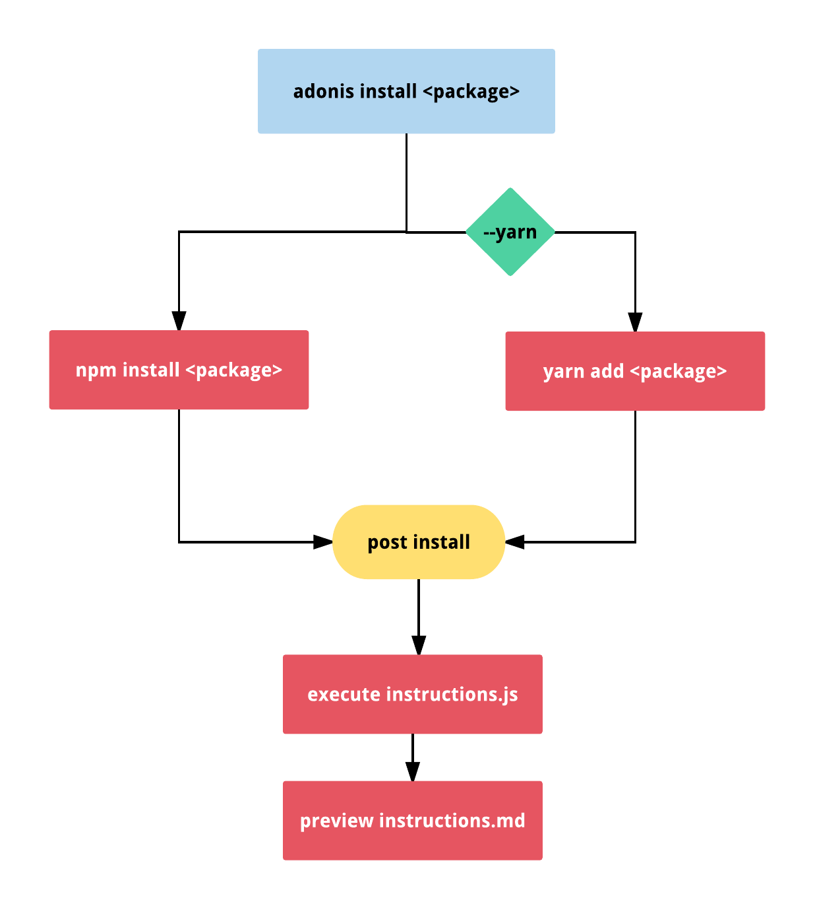

# 安装 AdonisJs 
AdonisJs 附带一个名为的命令 adonis install <package> ，与 npm installor 和 yarn add 类似。

事实上，adonis install 使用的就是 npm 或 yarn 来安装软件包，但在安装后还会执行额外的步骤。

## 命令执行

每个提供程序都可以有两个文件 instructions.js 和 instructions.md ，由 adonis 用于执行 post install 步骤。

#### instructions.js
该 js 文件导出一个函数。此函数可用于执行任何步骤，因为你可以在其中编写功能代码。

最常执行的步骤是

- 复制配置文件。

- 创建控制器，模型等实体。

#### instructions.md
该 md 文件是由提供者的用户手工遵循的一些小指令。因此，在这里写一些类似 GitHub 风格的使用指南。

